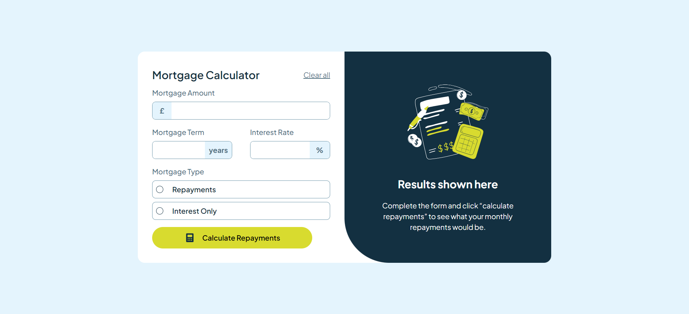

# Frontend Mentor - Mortgage repayment calculator solution

This is a solution to the [Mortgage repayment calculator challenge on Frontend Mentor](https://www.frontendmentor.io/challenges/mortgage-repayment-calculator-Galx1LXK73). Frontend Mentor challenges help you improve your coding skills by building realistic projects.

## Table of contents

- [Overview](#overview)
  - [The challenge](#the-challenge)
  - [Screenshot](#screenshot)
  - [Links](#links)
- [My process](#my-process)
  - [Built with](#built-with)
  - [What I learned](#what-i-learned)
  - [Continued development](#continued-development)
  - [Useful resources](#useful-resources)
- [Author](#author)
- [Acknowledgments](#acknowledgments)

## Overview

### The challenge

Users should be able to:

- Input mortgage information and see monthly repayment and total repayment amounts after submitting the form
- See form validation messages if any field is incomplete
- Complete the form only using their keyboard
- View the optimal layout for the interface depending on their device's screen size
- See hover and focus states for all interactive elements on the page

### Screenshot

### Links

- Solution URL: (https://github.com/donado10/mortgage_repayment_calculator)
- Live Site URL: (https://mortgage-repayment-calculator-rust.vercel.app/)

## My process

### Built with

- Semantic HTML5 markup
- CSS custom properties
- Flexbox
- CSS Grid
- Desktop-first workflow
- [React](https://reactjs.org/) - JS library
- [Typescript](https://www.typescriptlang.org/) - JS with syntax for types.
- [Tailwind](https://tailwindcss.com/) - A utility-first CSS framework

### What I learned

I learned how to use really well the useReducer hook so that I can easily manage the state in case of form.

### Continued development

I still want to use the useReducer hook to manage complex state specially for form.

### Useful resources

- [How to use the compound component design pattern](https://www.youtube.com/watch?v=26ogBZXeBwc) - This helped me for using the useReducer hook.

## Author

- Frontend Mentor - [@donado10](https://www.frontendmentor.io/profile/donado10)
- Twitter - [@Hey\_\_Ado](https://x.com/Hey__Ado)

## Acknowledgments

I'd like to thanks the frontend mentor team for supporting the Purchasing Power Parity because I'm based in Senegal and it is difficult to match the price offered by
some service providers
